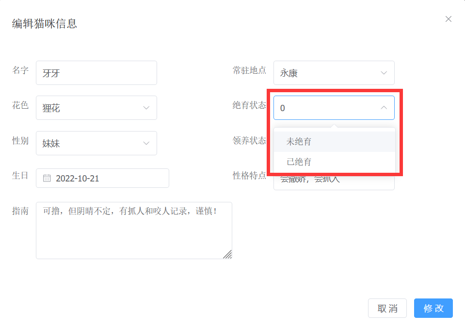

## 设置 el-table 行文字溢出省略

```css
.el-table__row .el-table__cell .cell {
  /* 文本显示省略号 */
  text-overflow: ellipsis;
  /* 溢出的内容将它隐藏 */
  overflow: hidden;
  /* 主要控制父元素容器里面子元素的排列方式 */
  display: -webkit-box;
  /* 实现限制文字显示多少行,也就是说要多少行是出现省略号,我这里设置两行就让文本出现省略号 */
  -webkit-line-clamp: 2;
  /* 属性规定框的子元素应该被水平或垂直排列 */
  -webkit-box-orient: vertical;
}
```

    ::: warning 注意
        这里一定要把scoped去掉，否则以上样式无效
    :::

## .vue 文件使用 sass 出现红色波浪线，具体代码如下

```css
<style lang="scss">
.el-form {
  display: flex;
  flex-wrap: wrap;

  .el-form-item {
    width: 50%;
  }
}
</style>
```

- 解决方案：
  找到 vuter 插件的扩展设置，在 settings.json 文件中，将 `"files.associations": { "*.vue": "html" }` 改成 `"files.associations": { "*.vue": "vue" }`

## element-plus 下拉框组件显示的是 value 值而不是 label 值



- 原因：后端传给前端的 value 值是 Number 类型的，但是 el-select 绑定的 value 值是 String 类型的，value 值的类型不匹配，所以拿到数据显示在页面上会出现一些小问题，所以我们需要对 value 的类型进行转换

- 解决方案：将 el-option 的 value="0" 改成 :value="0"(v-bind)即可，[参考思路](https://blog.csdn.net/qq_43779703/article/details/100693565)

## 从猫咪信息管理页面跳转到详细信息管理页面，路由跳转的同时携带猫咪详细信息的参数对象

```js
// Cats.vue

import { useRouter } from "vue-router";

// 路由器对象
let router = useRouter();

function handleManageDetail(index, catDetail) {
  router.push({
    name: "detail",
    params: {
      catDetail: JSON.stringify(catDetail),
    },
  });
}
```

```js
// Detail.vue

import { useRoute } from "vue-router";

// 当前路由
const route = useRoute();

onMounted(() => {
  console.log(JSON.parse(route.params)); // 这里报错，Uncaught (in promise) SyntaxError: JSON.parse: unexpected character at line 1 column 2 of the JSON data
});
```

### 错误原因

params 本身的值是已经是 JavaScript 类型的值了，不需要使用 JSON.parse 进行解析，这里应该获取的是 params 中的 catDetail 属性，把 route.params 改成 route.params.catDetail 即可。

## vscode 中注释 sass 报错

## element-plus 的日期选择器 el-date-picker 传入后端的日期比前端选择的日期少一天

- 解决方案：给 el-date-picker 加一个属性 ```value-format="YYYY-MM-DD"``` 且属性值一定要全部写成大写


